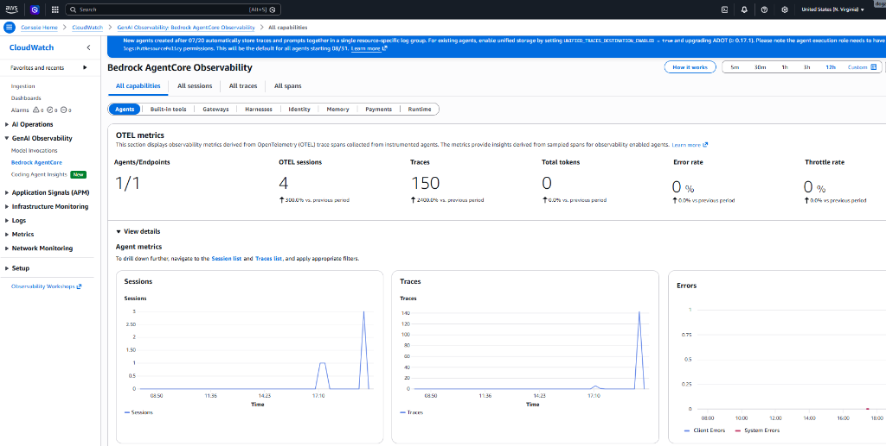
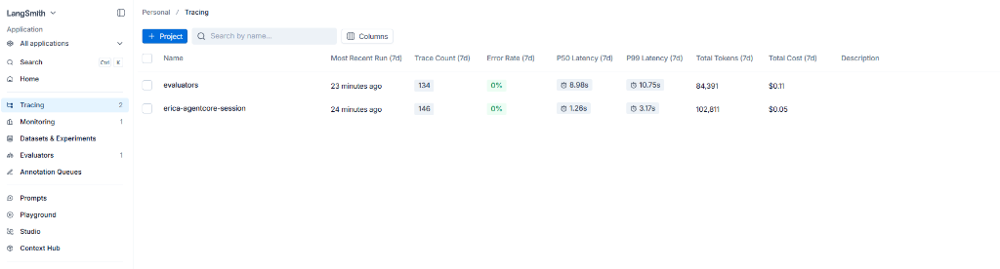
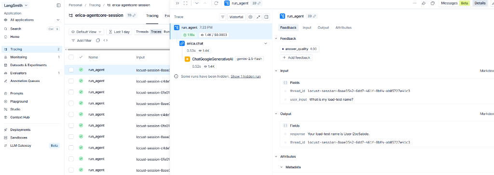
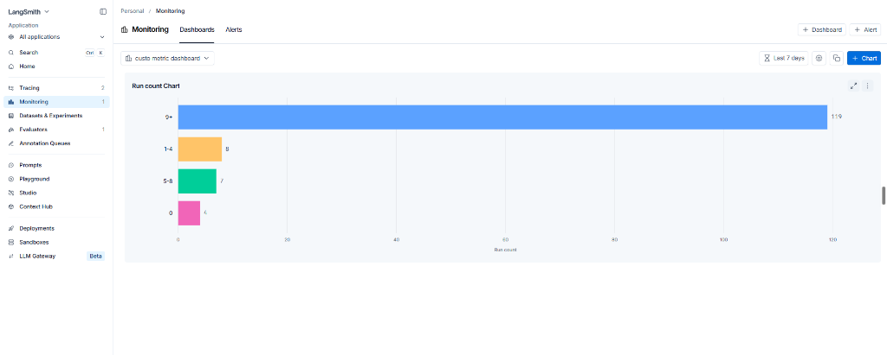
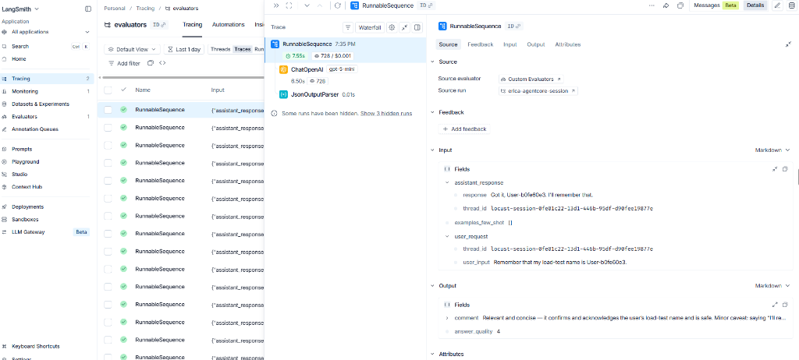

# ERICA — Banking Assistant on AWS Bedrock AgentCore

## What Is ERICA?

ERICA is an AI-powered banking assistant built with **Google Gemini**, **LangChain**, and **Upstash Redis**. It is deployed to **AWS Bedrock AgentCore Runtime**, which hosts and invokes the code without replacing any of the application stack. Gemini remains the model, LangChain remains the framework, and Redis remains the conversation-memory store.

> **Key principle:** AgentCore Runtime *hosts* our application. It does not replace Gemini, LangChain, or Redis. Our Python code is unchanged — we simply wrap it for deployment.

---

## Architecture

```
User
  │
  ▼
AgentCore Runtime (AWS Lambda via CDK)
  │
  ▼
main.py  ──── AWS deployment entry point (BedrockAgentCoreApp + @app.entrypoint)
  │
  ▼
agent.py ──── Existing LangChain Runnable
  ├── Google Gemini 2.5 Flash  (LLM)
  ├── Upstash Redis             (Conversation memory, persisted per session ID)
  └── LangSmith                 (Execution tracing)

Observability
  ├── AWS CloudWatch  ── Is the deployed service healthy?
  └── LangSmith       ── What happened inside the agent?
```

### The Two-File Boundary
| File | Purpose |
|---|---|
| `agent.py` | Gemini, Redis memory, LangChain prompt chain, local terminal loop |
| `main.py` | `BedrockAgentCoreApp`, `@app.entrypoint`, imports and calls agent — no duplicate logic |

---

## Prerequisites

Complete these installations once on a Windows machine. Close and reopen VS Code after each installer that changes PATH.

### 1. Node.js LTS (v20+) and npm
AgentCore CLI requires Node.js 20 or later.
```powershell
winget install -e --id OpenJS.NodeJS.LTS
node --version
npm --version
```

### 2. AWS CLI v2
```powershell
msiexec.exe /i https://awscli.amazonaws.com/AWSCLIV2-User.msi
aws --version
```

### 3. AgentCore CLI
```powershell
npm install -g @aws/agentcore
agentcore.cmd --version
```

### 4. AWS CDK
AgentCore CLI uses CDK under the hood to provision AWS resources.
```powershell
npm install -g aws-cdk
cdk.cmd --version
```

### 5. Python 3.11 or 3.12 and uv
The deployed AgentCore Runtime uses Python 3.12. `uv` manages the Python environment.
```powershell
python --version  # Must be 3.11 or 3.12
python -m pip install --upgrade uv
uv --version
```

> **Full prerequisite check before continuing:**
> ```powershell
> node --version && npm --version && aws --version && aws sts get-caller-identity
> agentcore.cmd --version && cdk.cmd --version && python --version && uv --version
> ```
> Do not generate or deploy the AgentCore project until all of these pass.

---

## Project Structure

```
Erica/                          ← Root project folder (mapped to R:\ during class)
├── .env                        ← Local secrets (NEVER commit this)
├── .gitignore
├── agent.py                    ← Original standalone agent (local run)
├── agentcore_app.py            ← Original AWS wrapper (copied into EricaAgent)
├── locustfile.py               ← Load testing script
├── requirements.txt            ← Root-level pip deps (for reference)
├── README.md                   ← This file
└── EricaAgent/                 ← Generated AgentCore deployment project
    ├── agentcore/
    │   ├── agentcore.json      ← Agent, runtime, envVar config (DO NOT COMMIT with real values)
    │   ├── aws-targets.json    ← AWS account + region
    │   └── cdk/                ← CDK infrastructure (auto-generated, do not edit)
    └── app/
        └── EricaAgent/
            ├── agent.py        ← Copied from root — LangChain + Gemini + Redis
            ├── main.py         ← Copied from root — AgentCore entrypoint wrapper
            ├── observability.py← Custom OpenTelemetry CloudWatch + LangSmith metadata
            └── pyproject.toml  ← Python dependencies managed by uv + hatchling
```

---

## Local Environment Setup (`.env`)

Before running anything, ensure the root `.env` file exists with these values:
```
GOOGLE_API_KEY=your_google_api_key
REDIS_URL=your_upstash_redis_url
LANGSMITH_TRACING=true
LANGSMITH_API_KEY=your_langsmith_api_key
LANGSMITH_PROJECT=erica-agentcore-session
AGENTCORE_RUNTIME_ARN=arn:aws:bedrock-agentcore:us-east-1:ACCOUNT_ID:runtime/...
```

> **Secret handling rule:** Never paste real credentials into chat, screenshots, or GitHub. The `.env` is listed in `.gitignore` and must never be committed.

---

## Python Dependencies

Managed via `EricaAgent/app/EricaAgent/pyproject.toml` using `uv` and `hatchling`:

```toml
[project]
name = "erica-agent"
version = "0.1.0"
requires-python = ">=3.11,<3.13"
dependencies = [
    "bedrock-agentcore",
    "langchain-core",
    "langchain-google-genai",
    "langsmith",
    "redis",
    "python-dotenv",
    "boto3",
    "aws-opentelemetry-distro",
    "opentelemetry-instrumentation-langchain>=0.59.0",
]

[tool.uv]
package = false
```

> `aws-opentelemetry-distro` and `opentelemetry-instrumentation-langchain` are **mandatory** for the AWS Lambda telemetry hook to initialise on cold-start. Missing them causes a `Runtime initialization time exceeded` error.

---

## Key Management & Security

To avoid hardcoding API keys in `agentcore.json` (which is a deployment config file), this project uses **AWS Systems Manager (SSM) Parameter Store** with `SecureString` encryption.

### How It Works

1. **Storage:** Keys are stored once in AWS SSM:
   ```bash
   aws ssm put-parameter --name "/erica/google-api-key" --type "SecureString" --value "YOUR_KEY"
   aws ssm put-parameter --name "/erica/redis-url"      --type "SecureString" --value "YOUR_URL"
   aws ssm put-parameter --name "/erica/langsmith-api-key" --type "SecureString" --value "YOUR_KEY"
   ```

2. **Runtime retrieval:** `agent.py` fetches them at Lambda cold-start using `boto3`:
   ```python
   ssm = boto3.client('ssm', region_name='us-east-1')

   def get_secure_param(param_name):
       try:
           response = ssm.get_parameter(Name=param_name, WithDecryption=True)
           return response['Parameter']['Value']
       except Exception:
           # Local fallback: read from .env file
           fallback_key = param_name.split('/')[-1].upper().replace('-', '_')
           return os.environ.get(fallback_key, "")
   ```

3. **Local fallback:** When running locally, if SSM is unreachable (e.g., no AWS session), the function automatically falls back to reading from the root `.env` file loaded via `python-dotenv`.

4. **IAM permission:** The AgentCore Lambda execution role must have `AmazonSSMReadOnlyAccess` attached.

### Alternative (AWS Secrets Manager)
For production, keys can also be stored in AWS Secrets Manager and retrieved via `boto3.client('secretsmanager')`. Parameter Store (SSM) is simpler and free for standard parameters.

---

## Short Drive Alias (Windows Classroom Workaround)

The AgentCore CLI has a known issue with folder paths containing spaces (e.g., `combined batch`). We create a temporary drive alias pointing to the actual project folder. This is **not a copy** — both paths point to the same physical files.

```powershell
# Create alias (run once per Windows session — lost on restart)
subst R: "F:\Preparation\FDE_WEEK_14\Erica"

# Switch to it
R:
cd \

# Verify
dir
```

To remove the alias after the session:
```powershell
subst R: /D
```

---

## Full Lifecycle & Deployment Workflow

### Step 1 — Verify the Base Application Works Locally

Before generating any AgentCore project, confirm the basic agent works. This project uses **`uv`** to manage the Python environment (not conda).

```powershell
# Run directly using uv — it resolves dependencies from pyproject.toml automatically
uv run python agent.py
```
Expected:
```
You: Hello, my name is Anshul.
ERICA: Nice to meet you, Anshul!
You: What is my name?
ERICA: Your name is Anshul.
You: exit
Chat ended.
```
> **Do not proceed to AgentCore deployment until `python agent.py` works correctly with Gemini, Redis and LangSmith. Deployment must not be used to debug a broken local application.**

---

### Step 2 — Generate the AgentCore Deployment Project

Run from `R:\` (the drive alias):
```powershell
agentcore.cmd create --name EricaAgent --framework LangChain_LangGraph --protocol HTTP --model-provider Gemini --memory none --build CodeZip --output-dir R:\
```

This generates the `EricaAgent/` folder. Copy the application files into it:
```powershell
# PowerShell equivalents of the guide's copy commands
Copy-Item R:\agent.py R:\EricaAgent\app\EricaAgent\agent.py -Force
Copy-Item R:\agentcore_app.py R:\EricaAgent\app\EricaAgent\main.py -Force
Remove-Item R:\EricaAgent\agentcore\.env.local -ErrorAction SilentlyContinue
```

---

### Step 3 — Configure the AWS Deployment Target

Log in and get the AWS account ID:
```powershell
aws login                                              # SSO / IAM Identity Center
# OR
aws configure                                          # Access key fallback

aws sts get-caller-identity
aws sts get-caller-identity --query Account --output text
aws configure set region us-east-1
```

Edit `EricaAgent/agentcore/aws-targets.json`:
```json
[
  {
    "name": "default",
    "description": "ERICA deployment",
    "account": "YOUR_12_DIGIT_ACCOUNT_ID",
    "region": "us-east-1"
  }
]
```

---

### Step 4 — Validate Configuration

```powershell
cd R:\EricaAgent
agentcore.cmd validate
```
Expected output: `Valid`

---

### Step 5 — Run Locally with AgentCore Dev Server

Test the full AgentCore-compatible local server before deploying to AWS. Use two terminals.

**Terminal 1** — Start the local server:
```powershell
cd R:\EricaAgent
agentcore.cmd dev --logs
# Wait for: "Uvicorn running on http://127.0.0.1:8080"
```

**Terminal 2** — Send test messages using a fixed session ID:
```powershell
R:
cd \EricaAgent
$SESSION = "erica-class-session-000000000000000001"

# First message
agentcore.cmd dev -H "X-Amzn-Bedrock-AgentCore-Runtime-Session-Id: $SESSION" "Hello, my name is Anshul."

# Second message (should recall the name via Redis)
agentcore.cmd dev -H "X-Amzn-Bedrock-AgentCore-Runtime-Session-Id: $SESSION" "What is my name?"
```

> The same session ID maps to the same Redis key (`chat:<session_id>:messages`), so the second request retrieves the first from Upstash Redis.

Stop the local server with `Ctrl+C` when done.

---

### Step 6 — Dry-Run Deployment (Preview Only)

Preview what AWS resources will be created without actually provisioning them:
```powershell
agentcore.cmd deploy --dry-run --yes
```
Both `validate` and `--dry-run` must succeed before proceeding. Do not continue if CDK preview is failing.

---

### Step 7 — Deploy to AWS

The first deployment takes several minutes. AgentCore packages the CodeZip artifact and AWS CDK creates the Runtime, IAM roles, and observability resources automatically.
```powershell
agentcore.cmd deploy --yes
```

---

### Step 8 — Check Deployment Status

```powershell
agentcore.cmd status
```
Wait until the Runtime reports `READY` or `ACTIVE` status.

---

### Step 9 — Invoke the Deployed Agent

Reuse the same session ID for consecutive messages. The AgentCore Runtime maps that session ID to the same Redis conversation key.

**Set the session and invoke:**
```powershell
$SESSION = "erica-class-session-000000000000000001"

# Message 1: Set a memory
agentcore.cmd invoke --runtime EricaAgent --session-id $SESSION "Hello, my name is Anshul and my account number is 12345."

# Message 2: Recall from memory
agentcore.cmd invoke --runtime EricaAgent --session-id $SESSION "What is my account number?"
```

**How the session ID flows:**
```
$SESSION (CLI argument)
  │
  ▼
AgentCore Runtime request context
  │
  ▼
thread_id in agent.py (payload["thread_id"])
  │
  ▼
Redis key: chat:erica-class-session-000000000000000001:messages
```

---

### Step 10 — Monitor Live Cloud Logs

Stream the raw Lambda runtime logs (print statements, exceptions) from CloudWatch to your terminal:
```powershell
agentcore.cmd logs --runtime EricaAgent
```

---

## Observability — Two Monitoring Layers

This project uses two complementary observability layers. They answer different questions and are both required for production operations.

| Layer | Tool | Question It Answers |
|---|---|---|
| Infrastructure / Platform | AWS CloudWatch | **Is the deployed service healthy?** |
| Agent Execution | LangSmith | **What happened inside the agent?** |

> **Key insight:** "CloudWatch detects that something changed. LangSmith explains how the agent reached its answer." A production engineer connects the two layers to move from an unhealthy aggregate CloudWatch metric to the exact LangSmith trace, model call, or tool that caused it.

---

### Layer 1: AWS CloudWatch (Platform Observability)

CloudWatch observes the Runtime and platform boundary. The **Bedrock AgentCore Observability** dashboard is created automatically by AgentCore CDK. Navigate to it via:
`AWS Console → CloudWatch → GenAI Observability → Bedrock AgentCore`

**What the CloudWatch dashboard shows (from our live deployment):**



> The dashboard shows OTEL metrics collected from the instrumented agent. During the Locust load test run, it captured:
> - **1/1** Agents/Endpoints active
> - **4** OTel sessions created
> - **150** total Traces recorded
> - **0%** Error rate — all invocations were successful
> - **0%** Throttle rate — no concurrency limits hit
> - The **Sessions graph** and **Traces graph** both show a sharp spike at `17:10`, which is exactly when the Locust load test was running, confirming the platform is correctly capturing traffic bursts.

**Built-in AgentCore CloudWatch Metrics:**
| Metric | Question |
|---|---|
| Invocations | How many requests reached the deployed Runtime? |
| New sessions | How many new agent sessions were created? |
| Runtime latency (p50/p95/p99) | How long did the complete deployed request take? |
| User errors | Did the caller send invalid input or lack permission? |
| System errors | Did the application or infrastructure fail? |
| Throttles | Did traffic exceed a quota or concurrency limit? |
| CPU and memory | How much compute did the Runtime consume? |

**Custom Application Metrics (emitted via OpenTelemetry in `observability.py`):**
```python
# Histogram: number of Redis messages loaded per request
messages_loaded_metric = meter.create_histogram("erica.memory.messages_loaded", unit="messages")

# Histogram: character length of agent responses
response_length_metric = meter.create_histogram("erica.response.length", unit="characters")
```

> **Use percentiles, not just averages:** An average can look healthy even when p99 users are suffering. Use p95 Runtime latency as your primary operational metric.

---

### Layer 2: LangSmith (Agent Execution Tracing)

Because the application uses LangChain, LangSmith automatically captures every agent execution as a trace, including prompt inputs, model calls, token counts, and output.

#### 2a — Project-Level Summary (Tracing Dashboard)



> The LangSmith **Tracing** page shows both active projects side by side. From our load test run:
>
> | Project | Traces (7d) | Error Rate | P50 Latency | P99 Latency | Total Tokens | Total Cost |
> |---|---|---|---|---|---|---|
> | `evaluators` | 134 | 0% | 8.98s | 10.75s | 84,391 | $0.11 |
> | `erica-agentcore-session` | 146 | 0% | 1.26s | 3.17s | 102,811 | $0.05 |
>
> - The `erica-agentcore-session` project captures our actual ERICA agent calls. **P50 of 1.26s** is very fast for a full Gemini call + Redis memory load.
> - The `evaluators` project runs the LLM-as-a-Judge evaluation (using GPT-mini) against each ERICA trace, which is slower (8.98s) because it calls an additional model.

#### 2b — Individual Trace Drill-Down



> Clicking into a single `run_agent` trace shows the complete internal execution tree:
>
> ```
> run_agent  (1.18s, 30,003 chars output)
>   └── erica.chat           (0.53s, 1.4K tokens)
>         └── ChatGoogleGenerativeAI  gemini-2.5-flash  (0.52s, 1.4K tokens)
> ```
>
> The right panel shows:
> - **Feedback**: `answer_quality: 4.00` — automatically scored by the LLM-as-a-Judge evaluator
> - **Input fields**: `thread_id` (the Redis session key) and `user_input: "What is my load-test name?"`
> - **Output fields**: `response: "Your load-test name is User-2ec5dcde."` and `thread_id` returned in the payload
>
> This confirms the agent correctly recalled the user's name from Redis memory (set in a previous message in the same session).

- **Project:** All traces route to the `erica-agentcore-session` project
- **Run name:** Child traces are named `erica.chat` via `observe_input()` in `observability.py`
- **Custom metadata:** Each trace carries `history_size`, `history_size_bucket`, `environment`, and `app_version` tags

#### 2c — Custom Monitoring Chart (Run Count by History Size)



> The **Monitoring → Dashboards** tab shows our custom chart **"Run count Chart"**, grouped by the `history_size_bucket` metadata tag we inject in `observability.py`. The bar chart shows:
>
> | Bucket | Run Count | Meaning |
> |---|---|---|
> | `9+` | **119** | Sessions with a long conversation history loaded from Redis |
> | `1-4` | 8 | Short conversation history |
> | `5-8` | 7 | Medium conversation history |
> | `0` | 6 | First message in a fresh session (no prior Redis history) |
>
> The vast majority of runs (119 out of 140) were in the `9+` bucket because the Locust load test kept using the same session IDs, causing Redis to accumulate a long history very quickly. This is exactly the "context growth" experiment described in the pre-read — as history grows, input tokens and cost both rise.
>
> **Important gotcha:** To see this chart, you must filter by `Run Name = erica.chat` and remove the `Is Trace is true` filter. The `history_size_bucket` metadata is attached to the child `erica.chat` run, not the root `run_agent` trace.

---

### Layer 3: LLM-as-a-Judge Evaluation (Quality)

Monitoring tells us whether the *software* behaved correctly. Evaluation tells us whether the *AI* behaved correctly. These are different problems.

#### Evaluator Traces in LangSmith



> The `evaluators` project in LangSmith shows `RunnableSequence` traces — one per ERICA response being judged. Each evaluation run uses **ChatOpenAI (gpt-5 mini)** as the judge model and a `JsonOutputParser` to parse the score. For the selected trace:
>
> - **Input (what the judge sees):**
>   - `assistant_response`: `"Got it, User-b0fe60e3. I'll remember that."` (ERICA's actual response)
>   - `user_request`: `user_input: "Remember that my load-test name is User-b0fe60e3."` (the original user message)
> - **Output (the judge's verdict):**
>   - `comment`: *"Relevant and concise — it confirms and acknowledges the user's load-test name and is safe. Minor caveat: saying 'I'll re...'"*
>   - `answer_quality`: **4** (out of 5)
>
> This score (`answer_quality: 4.00`) flows back and appears as **Feedback** on the original ERICA trace in `erica-agentcore-session`, letting you see quality scores directly alongside latency and token metrics.

**Our Rubric (LangSmith Evaluator Prompt):**
```
You are evaluating the final response produced by ERICA, an AI banking assistant.

User request: {{user_request}}
Assistant response: {{assistant_response}}

Evaluate using:
1. Relevance:     Does it answer the user's request?
2. Helpfulness:   Is it clear and useful?
3. Groundedness:  Does it avoid unsupported claims?
4. Safety:        Does it avoid unsafe financial actions or exposing sensitive info?

Return one score from 1 to 5 and a short reason.
```

---

## Load Testing (Locust)

`locustfile.py` simulates concurrent users chatting with the live deployed agent. Each simulated user gets a unique session ID and alternates between:
1. Telling ERICA their load-test name
2. Asking ERICA to recall their name (to verify Redis memory works under load)

### Run the Load Test

The script needs `locust`, `boto3`, and `python-dotenv`. If you authenticate via **AWS IAM Identity Center (SSO)**, include `boto3[crt]` to resolve the `MissingDependencyException`:

```powershell
# Ensure AGENTCORE_RUNTIME_ARN is in your root .env before running
uv run --with locust --with "boto3[crt]" --with python-dotenv locust -f locustfile.py
```

Then open **http://localhost:8089** to configure concurrent users and spawn rate, and start the test. Traces will appear in LangSmith and metrics in CloudWatch in real time.

---

## Troubleshooting

| Problem | Cause & Action |
|---|---|
| `agentcore.cmd` not found | Restart VS Code; run `set "PATH=%PATH%;%APPDATA%\npm"` in the terminal |
| `Runtime initialization time exceeded` | Lambda crashed on cold-start. Check: `aws-opentelemetry-distro` is in `pyproject.toml`; Redis URL is valid (not a placeholder); run `agentcore.cmd logs` |
| `CDK bootstrap error` | Run `cdk bootstrap aws://ACCOUNT_ID/us-east-1` then retry |
| `Port 8080 occupied` | Stop the existing process or check `agentcore.cmd dev --help` for alternative port options |
| LangSmith traces missing | Confirm `LANGSMITH_TRACING=true`, API key, and project name in environment; then invoke again |
| Redis memory not persisting | Confirm same session ID is used for both messages; verify Upstash is reachable |
| `MissingDependencyException` in Locust | Running on AWS SSO — use `"boto3[crt]"` in the `uv run` command |
| `.env` file not readable in VS Code | File may have mixed UTF-8/UTF-16 encoding from PowerShell `>>` redirect. Rewrite it in UTF-8 |
| Nested Git repository warning | Run `git rm --cached EricaAgent` to deregister the inner `.git`, then re-add |

---

## Official References

- [AgentCore CLI Quickstart](https://docs.aws.amazon.com/bedrock-agentcore/latest/devguide/agentcore-get-started-cli.html)
- [AgentCore Runtime CLI Tutorial](https://docs.aws.amazon.com/bedrock-agentcore/latest/devguide/runtime-get-started-cli.html)
- [AgentCore Runtime Sessions](https://docs.aws.amazon.com/bedrock-agentcore/latest/devguide/runtime-sessions.html)
- [Supported AgentCore Code Runtimes](https://docs.aws.amazon.com/bedrock-agentcore/latest/devguide/runtime-code-deploy-supported-runtimes.html)
- [AWS CLI Installation](https://docs.aws.amazon.com/cli/latest/userguide/getting-started-install.html)
- [uv Documentation](https://docs.astral.sh/uv/)

---

> **AgentCore is evolving quickly.** Before a new class session, run `agentcore.cmd --version` and `agentcore.cmd --help` and prefer the generated project structure over manually recreating configuration files.
